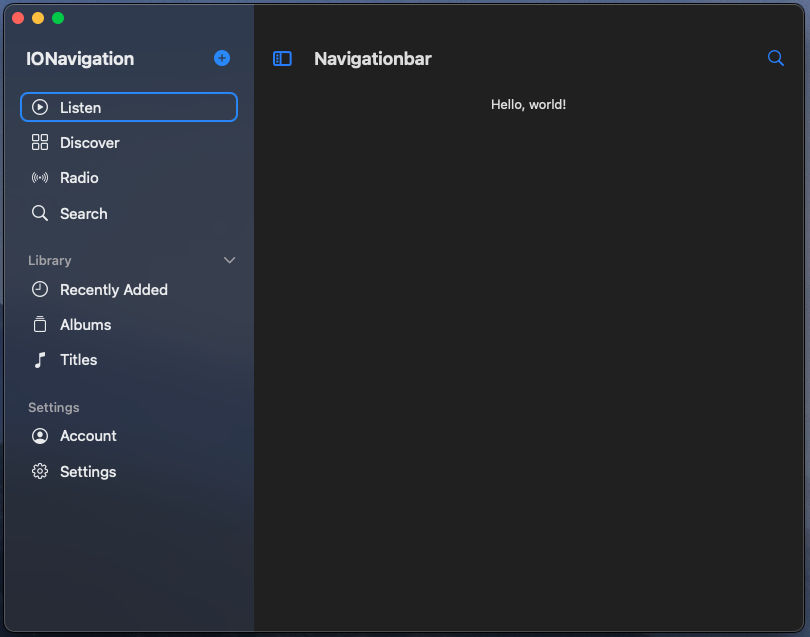
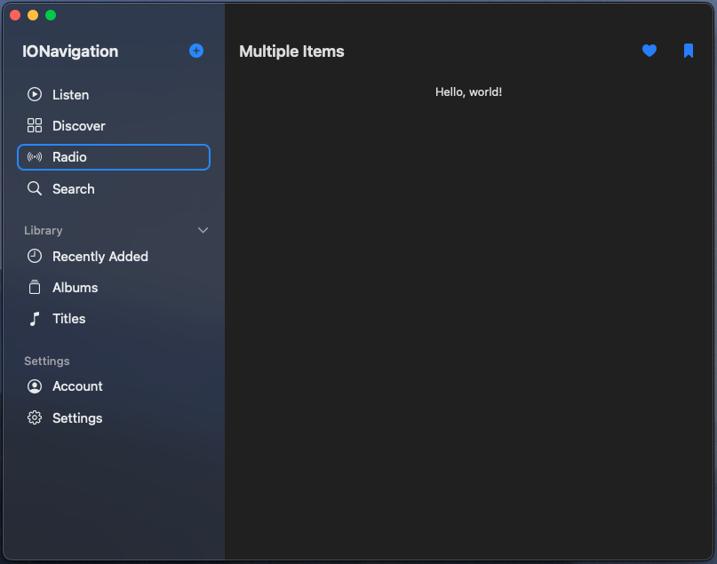
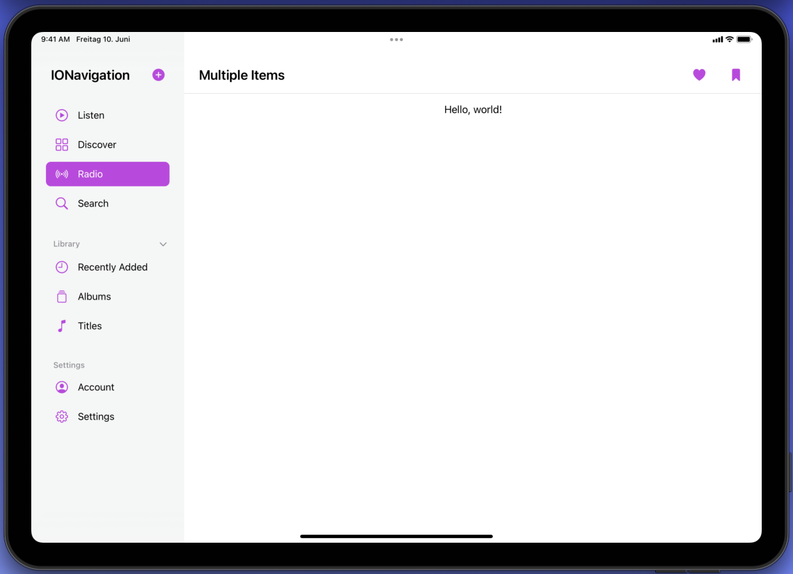
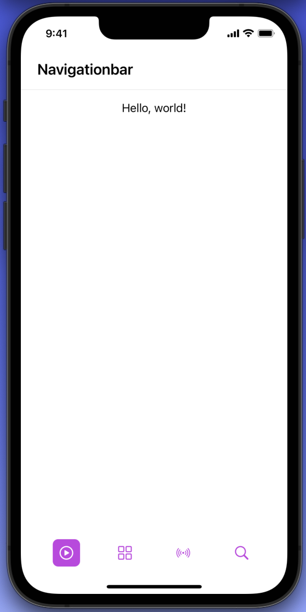

# IONavigation

A simple and highly customizable Sidebar, a Tabbar and a Navigationbar for iOS, iPadOS and macOS, written in 100% SwiftUI.


---

### Support
If you, or your company, use any of my projects or like what I'm doing, kindly consider supporting me.

I really appreciate you **[buying me a coffee ☕️](https://ko-fi.com/kaevin)**


---

### Let's Connect

- Follow me on **[👨‍💻 Github](https://github.com/kaevinio)** and stay updated on free and open-source software
- Follow me on **[🐦 Twitter](https://twitter.com/iamkaevin)** to get updates on my latest projects

---


## Content
- [Features](#features)
- [Screenshots](#screenshots)
- [Preview](#preview)
- [Installation](#installation)
- [How to Use](#how-to-use)


## Features
- [x] Availability on iOS, iPadOS and macOS
- [x] Show a header and a button (optional) in the Sidebar
- [x] Add unlimited groups and views to the Sidebar
- [x] Collapse groups (or set them as not collapsable)
- [x] Hover over elements (iPadOS & macOS)
- [x] Adapts to regular and compact mode (iPadOS)
- [x] Add the integrated Navigationbar to your views
- [x] Add a back button to the Navigationbar
- [x] Add one or multiple items to the Navigationbar
- [x] Set your custom color


## Screenshots
#### macOS
 

#### iPadOS
 

#### iOS
 


## Preview
<video src="https://user-images.githubusercontent.com/95750332/199588478-cc3bb161-07d0-4da1-8d42-6ce66d0718f6.mov" width="600">|


## Installation
##### Requirements
- iOS 15.0+ / macOS 12.0
- Xcode 13+
- Swift 5+

##### Swift Package Manager
In Xcode, go to `File > Add Packages` and add `https://github.com/kaevinio/IONavigation.git`. Add the package to all your targets.


## How to Use
#### Sidebar & Tabbar
The Sidebar consists of several groups, which contain individual views and is displayed on macOS and iPadOS. The Tabbar contains individual views and is available on iOS as well as in compact windows on iPadOS.

- To use the package, you need to `import IONavigation` on top of the files you want to use it in

- Create a new SwiftUI file and name it `NavigationView` (or whatever name you'd like for your navigation)
- Add the respective environment value for checking the window size to determine whether the Sidebar or the Tabbar will be used (this is only available on iOS)
```Swift
#if os(iOS)
@Environment(\.horizontalSizeClass) var horizontalSizeClass
#endif
```
- In your view's body, setup the Sidebar and the Tabbar according to the horizontalSizeClass
```Swift
#if os(iOS)
if horizontalSizeClass == .compact {
      Tabbar(items: tabbarItems, color: .blue)
} else {
      Sidebar(color: .blue, header: "IONavigation", itemGroups: sidebarItemGroups, actionIcon: Image(systemName: "plus.circle.fill"), action: add)
}
#else
Sidebar(color: .blue, header: "IONavigation", itemGroups: sidebarItemGroups, actionIcon: Image(systemName: "plus.circle.fill"), action: add)
#endif
```
Note: `Header`, `actionIcon` and `action` are optional. If you don't use a `header`, the `actionIcon` will not be displayed either.

You pass an array of `Item` for the Tabbar but an array of `ItemGroup` to the Sidebar. This is because the Sidebar supports different groups, which can be collapsed. The color passed to the Sidebar is used as the default selection background. You can set custom backgrounds for each sidebar item. Check out the example project on how to do it.

You can also select views from your sidebar programmatically. In your view, add the following property:

```Swift
@StateObject private var sidebarSelection = SidebarSelection.shared
```

You can then set `sidebarSelection` with the ID of the view you want to select, e.g. in a function:

```Swift
private func selectSearchTab() {
    sidebarSelection.selectedViewID = HomeTab.search.rawValue
}
```
You can find the respective code in the example project.


#### Navigationbar
Using the built-in Navigationbar is optional, as it does not belong to the Sidebar or the Tabbar. To use it, navigate to the view you'd like to use it in. First, `import IONavigation` at the top.

- Create a VStack with zero spacing and add the NavigationBar at the top:
```Swift
var body: some View {
      VStack(spacing: 0) {
          Navigationbar(title: "Header")

          // Here will be your views
          ScrollView {
              Text("Hello, world!")
                  .padding()
          }
      }
      .frame(maxWidth: .infinity, maxHeight: .infinity, alignment: .center)
      .background(Color("primaryBackground"))
}
```

This will display a blank Navigationbar with a header. You can also add either a **BackButton**, which is displayed on the *leading* side of the header (for deeper navigation) or you can add one or multiple **NavigationItems**, which will be added to *trailing* side of the Navigationbar. You can choose between an **icon** and **text** to be shown.

- To show NavigationItems, use the built-in ViewModifier `.navigationItem`. There is a specific navigationItem with which you can toggle the sidebar (on macOS and iPadOS). It will show on the leading side of the Navigationbar and its value value is saved in AppStorage, so your users won't have to toggle it on each app start.
```Swift
var body: some View {
      VStack(spacing: 0) {
          Navigationbar(title: "Header")
              .sidebarToggle(color: .blue)
              .navigationItem(image: Image(systemName: "heart.fill"), color: .blue, action: {})
              .navigationItem(image: Image(systemName: "bookmark.fill"), color: .blue, action: {})

          // Here will be your views
          ScrollView {
              Text("Hello, world!")
                  .padding()
          }
      }
      .frame(maxWidth: .infinity, maxHeight: .infinity, alignment: .center)
      .background(Color("primaryBackground"))
}
```

In the **Example** directory you can find demo code to show how to setup all components.
